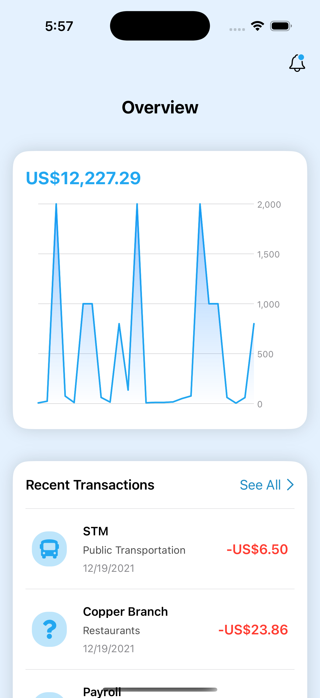
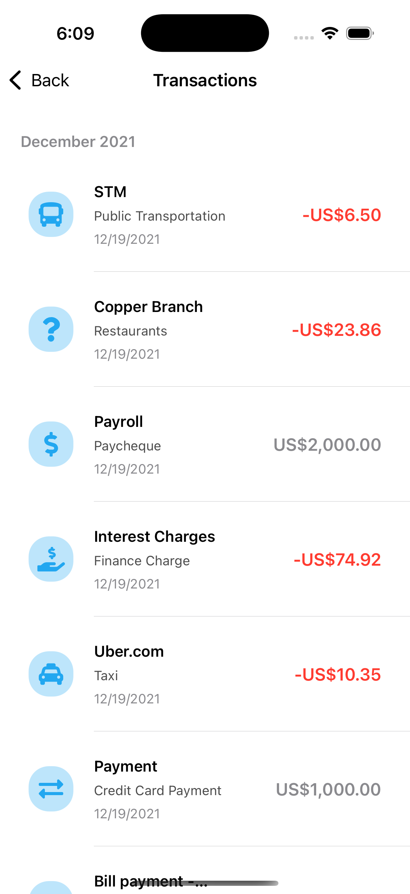

# Expense Tracker

**Expense Tracker** is a SwiftUI-based iOS application that helps users manage their expenses, visualize transaction trends, and stay on top of their finances. The app leverages Combine for API integration, Charts for interactive data visualization, and a clean and intuitive user interface.

### Features

 **Overview Section**

Provides a summary of financial data at a glance.

Displays an interactive chart for transaction trends.

**Charts View**

A dynamic chart built with SwiftUI's Charts framework.

Displays transaction data using LineMark and AreaMark.

Interactive features include:

Tooltip showing exact values when hovering over points.

Visual indicators for selected data points.

Automatically calculates the net total of all transactions displayed in the chart.

**Transactions List**

Organized into sections by date using an OrderedDictionary.

Displays details of individual transactions:

Merchant, category, amount, and more.

Uses FontAwesomeCode icons for categories.

Clean, modern design with customizable styling.

**API Integration**

Uses Combine for seamless API calls to fetch transaction data.

Decodes JSON responses into the Transaction model.

Includes error handling for robustness.

###### Custom Models

Transaction Model: Comprehensive representation of a financial transaction, including:

Properties like amount, category, merchant, and more.

Computed properties such as signedAmount for debits and credits.

Category Model: Supports both main and subcategories with unique IDs and icons.

###### Custom Styling

Dark mode support.

Themed icons and consistent typography.

### Visual Overview

### Screens

**Main Screen (Overview)**
 

 

Displays a summary section and interactive charts.

Shows a list of recent transactions.

### Transactions List
 

 

Categorized and organized view of transactions.

Inline navigation for exploring transaction details.

**Charts View**

Interactive transaction trends visualization.

Dynamic interaction with data points.

How to Run the Project

Clone this repository:

git clone [https://github.com/MashhoodQadeer/Expense-Tracker.git](https://github.com/MashhoodQadeer/Expense-Tracker.git)

Open the project in Xcode.

open Expense Tracker.xcodeproj

Build and run the project on a simulator or physical device.

Technologies Used

**SwiftUI:** For building a reactive and declarative UI.

**Combine:** To handle asynchronous API calls and data streams.

**Charts:** For rich and interactive data visualizations.

**FontAwesomeCode**: To display category-specific icons.

**OrderedCollections**: For maintaining transaction ordering.

###### Key Components

**Transaction Model**

A comprehensive structure to represent financial data, with computed properties and JSON decoding.

Includes utility functions to organize transactions by date.

**Charts View**

Utilizes SwiftUI Charts for dynamic graphing.

Allows users to interact with transaction trends visually.

### Networking

Uses URLSession and Combine for efficient API communication.

**Generic decoding** into models ensures scalability for different endpoints.

###### Future Improvements

1. Add budget tracking and analytics.

3. Push notifications for payment reminders.

5. Integration with third-party banking APIs.

Swift community for ongoing inspiration and support.

